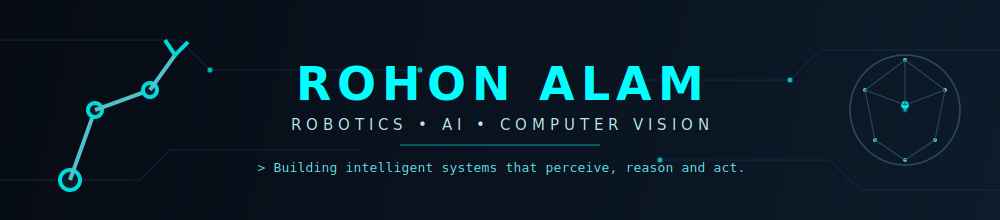

<picture>
  <source media="(prefers-color-scheme: dark)" srcset="banner.svg">
  <source media="(prefers-color-scheme: light)" srcset="banner.svg">
  
</picture>

`M.Tech, Robotics & AI @ IIT Guwahati`

  
  
  
  

---

### 🧑‍💻 About Me

- 🎓 M.Tech, Robotics & AI @ IIT Guwahati
- 🔬 Researching 3D Urban Reconstruction using Video Data
- 👁️ Passionate about Computer Vision, Robotics and Deep Learning
- 💻 Competitive Programmer | Solving problems on LeetCode
- 🌱 Always exploring new technologies and building cool projects
- 🎯 Building intelligent systems that don't just compute — they perceive, adapt, and create real-world impact

> *"The best way to predict the future is to invent it."* — Alan Kay

---

### 📊 GitHub Stats

---

### 🏅 Trophies

---

### 🐍 Contribution Snake

---

### 📈 Activity Graph

---

### 🏆 LeetCode Stats

---

### 🔬 Research

**3D Urban Reconstruction using Video Data**

`[ PLACEHOLDER: 1–2 line description of the research — problem, approach, and what makes it interesting ]`

`Structure from Motion` `SLAM` `Neural Rendering`

---

### 💼 Featured Projects

---

### 🛠️ Tech Stack

**Languages**

**AI / ML / CV**

**Robotics / Dev Tools**

---

### 🚀 Currently Exploring

Deep Learning for 3D Vision

SLAM & Visual Odometry

Neural Radiance Fields (NeRF)

Reinforcement Learning

`[ PLACEHOLDER: adjust the numbers above (0–100) to reflect your actual comfort level in each area ]`

---

### 🎯 Goals for 2026

- [ ] `[ PLACEHOLDER: e.g. "Solve 500+ LeetCode problems" ]`
- [ ] `[ PLACEHOLDER: e.g. "Publish a research paper" ]`
- [ ] `[ PLACEHOLDER: e.g. "Contribute to an open-source robotics project" ]`
- [ ] `[ PLACEHOLDER: e.g. "Secure a great placement" ]`

---

### 📫 Connect

- GitHub: [github.com/RohonAlam](https://github.com/RohonAlam)
- LinkedIn: [linkedin.com/in/rohon-alam-53a694219](https://www.linkedin.com/in/rohon-alam-53a694219/)
- LeetCode: [leetcode.com/u/rohon97](https://leetcode.com/u/rohon97/)
- Email: `PLACEHOLDER_EMAIL@gmail.com`

---

