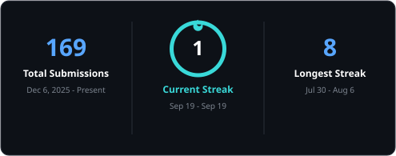
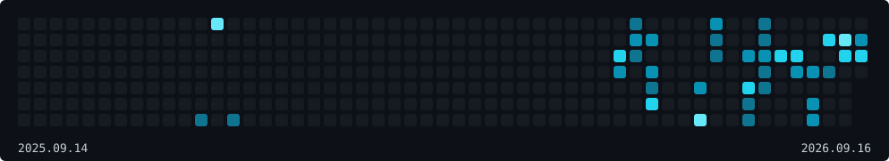

<div align="center">


</div>

<!--
  ============================================================================
  README.md — AI OS Profile
  Every value in this file is sourced from assets/config.md. Edit that file
  first, then mirror the change here (GitHub renders README.md standalone —
  it cannot pull values from config.md at render time).

  A note on the live widgets in this file: github-readme-stats,
  github-readme-streak-stats, github-readme-activity-graph, LeetCode card
  renderers, and visitor-badge are third-party community services, not
  Anthropic or GitHub products. I can't guarantee their current uptime or
  exact query-parameter syntax from here — if a badge doesn't render after
  you publish this, check the service's own repo for its current usage docs.
  ============================================================================
-->

<div align="center">


</div>


## BOOT SCREEN

```
AI OPERATING SYSTEM v2.0
Boot Sequence...
[██████████████████████████] 100%

✓ Computer Vision Engine
✓ Robotics Runtime
✓ Deep Learning Runtime
✓ Neural Rendering
✓ Research Database
✓ GitHub API
✓ LeetCode Knowledge Base

SYSTEM READY.
```


## SYSTEM INFORMATION


## SYSTEM DASHBOARD

<div align="center">


</div>

| 🔥 GitHub Streak | 🔥 LeetCode Streak |
| :---: | :---: |
|  |  |


<!--  -->


<!-- GitHub Snake -->
<picture>
  <source media="(prefers-color-scheme: dark)" srcset="./profile/snake-dark.svg">
  <source media="(prefers-color-scheme: light)" srcset="./profile/snake.svg">
  
</picture>

<!-- LeetCode Heatmap -->


<!-- GitHub Trophies -->



## ACTIVE MODULES


## 📁 PROJECT DATABASE

```text
[001] ───────────────────────────────────────────────────────────────

NAME         3D Terrain Generator
STATUS       ● ONLINE
DESCRIPTION  Desktop application that converts DEM data into
             printable 3D terrain models.

TECH STACK   Python • PyQt • OpenCV • GIS

─────────────────────────────────────────────────────────────────────
```
<a href="https://github.com/RohonAlam/3D-Terrain-Generator">
  
</a>

```text
[002] ───────────────────────────────────────────────────────────────

NAME         LeetCode
STATUS       ● ACTIVE
DESCRIPTION  Collection of DSA solutions with detailed notes.

TECH STACK   Python • C++ • Algorithms

─────────────────────────────────────────────────────────────────────
```
<a href="https://github.com/RohonAlam/LeetCode">
  
</a>

```text
[003] ───────────────────────────────────────────────────────────────

NAME         E_Commerce_Project
STATUS       ● COMPLETED
DESCRIPTION  Full-Stack E-Commerce Website using the MERN Stack.

TECH STACK   MongoDB • Express.js • React.js • Node.js

─────────────────────────────────────────────────────────────────────
```
<a href="https://github.com/RohonAlam/E_Commerce_Project">
  
</a>


## SKILL MATRIX

```
Python              ██████████████████░░  95%
C++                 █████████████████░░░  85%
ROS                 ████████████████░░░░  80%
OpenCV              █████████████████░░░  85%
PyTorch             ███████████████░░░░░  75%
Docker              ████████████░░░░░░░░  60%
Linux               ████████████████░░░░  80%
Git                 █████████████████░░░  85%
```

> Levels above are round, editable placeholders (see `assets/config.md` →
> SKILL MATRIX) — not a measured benchmark. Adjust to your honest level.


## RESEARCH TIMELINE

```
2023 ── AI Voice Assistant
  │
2024 ── MERN Stack Development
  │
2025 ── Joined IIT Guwahati (M.Tech, Robotics & AI)
  │
2026 ── 3D Urban Reconstruction using Video Data
  │
Future ── Research Publication
```


## CURRENT GOALS

- [ ] `[ Solve 500+ LeetCode problems ]`
- [ ] `[ Publish a research paper ]`
- [ ] `[ Contribute to an open-source robotics project ]`
- [ ] `[ Secure a great placement ]`


## 📡 COMMUNICATION HUB

<div align="center">

<a href="https://github.com/RohonAlam">
  
</a>

<a href="https://www.linkedin.com/in/rohon-alam-53a694219/">
  
</a>

<a href="https://leetcode.com/u/rohon97/">
  
</a>

<a href="mailto:ra.official.9775@gmail.com">
  
</a>

</div>


## FOOTER


<div align="center">

</div>


