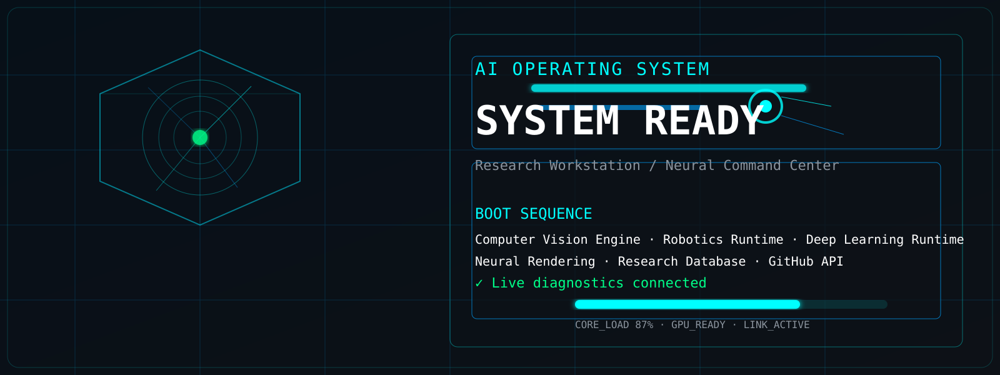
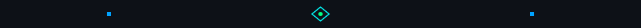
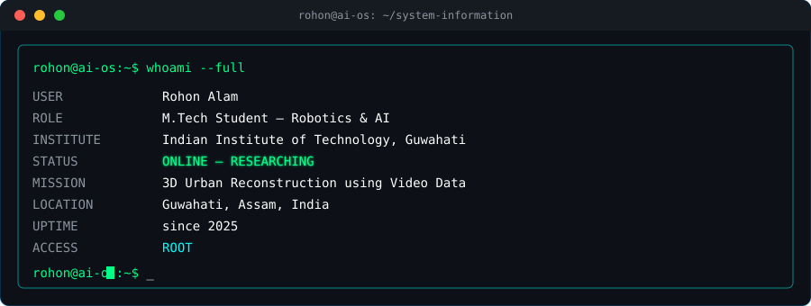
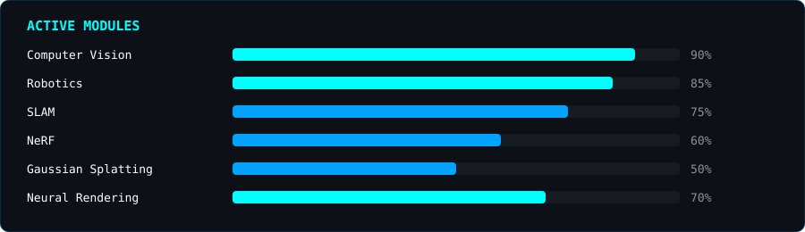
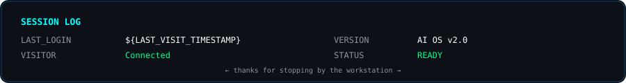

<div align="center">



</div>

<!--
  ============================================================================
  README.md — AI OS Profile
  Every value in this file is sourced from assets/config.md. Edit that file
  first, then mirror the change here (GitHub renders README.md standalone —
  it cannot pull values from config.md at render time).

  A note on the live widgets in this file: github-readme-stats,
  github-readme-streak-stats, github-readme-activity-graph, LeetCode card
  renderers, and visitor-badge are third-party community services, not
  Anthropic or GitHub products. I can't guarantee their current uptime or
  exact query-parameter syntax from here — if a badge doesn't render after
  you publish this, check the service's own repo for its current usage docs.
  ============================================================================
-->

<div align="center">


</div>



## `[ SECTION 1 ]` BOOT SCREEN

```
AI OPERATING SYSTEM v2.0
Boot Sequence...
[██████████████████████████] 100%

✓ Computer Vision Engine
✓ Robotics Runtime
✓ Deep Learning Runtime
✓ Neural Rendering
✓ Research Database
✓ GitHub API
✓ LeetCode Knowledge Base

SYSTEM READY.
```


## `[ SECTION 2 ]` SYSTEM INFORMATION




## `[ SECTION 3 ]` SYSTEM DASHBOARD

<div align="center">

<div align="center">


</div>


<!-- LeetCode card — replace ADD_YOUR_LEETCODE_USERNAME in assets/config.md, then here -->


</div>


## `[ SECTION 4 ]` ACTIVE MODULES




```

## 📁 PROJECT DATABASE

| ID | Project | Status | Repository |
|:--:|---------|:------:|-----------|
| 001 | **3D Terrain Generator** | 🟢 Online | **[Open Repository](https://github.com/RohonAlam/3D-Terrain-Generator)** |
| 002 | **LeetCode** | 🟢 Active | **[Open Repository](https://github.com/RohonAlam/LeetCode)** |
| 003 | **AI Voice Assistant** | 🟢 Stable | **[Open Repository](https://github.com/RohonAlam/AI-Voice-Assistant)** |
| 004 | **E-Commerce Project** | 🟢 Stable | **[Open Repository](https://github.com/RohonAlam/E_Commerce_Project)** |


## `[ SECTION 6 ]` SKILL MATRIX

```
Python              ██████████████████░░  95%
C++                 █████████████████░░░  85%
ROS                 ████████████████░░░░  80%
OpenCV               █████████████████░░░  85%
PyTorch             ███████████████░░░░░  75%
Docker              ████████████░░░░░░░░  60%
Linux               ████████████████░░░░  80%
Git                 █████████████████░░░  85%
```

> Levels above are round, editable placeholders (see `assets/config.md` →
> SKILL MATRIX) — not a measured benchmark. Adjust to your honest level.


## `[ SECTION 7 ]` RESEARCH TIMELINE

```
2023 ── AI Voice Assistant
  │
2024 ── MERN Stack Development
  │
2025 ── Joined IIT Guwahati (M.Tech, Robotics & AI)
  │
2026 ── 3D Urban Reconstruction using Video Data
  │
Future ── Research Publication
```


## `[ SECTION 8 ]` CURRENT GOALS

- [ ] `ADD_GOAL_1`
- [ ] `ADD_GOAL_2`
- [ ] `ADD_GOAL_3`

> Left blank on purpose — I don't have your actual 2026 goals on file. Fill
> these in via `assets/config.md`, then mirror them here.


## `[ SECTION 9 ]` CONTACT

```
$ cat contact.json
{
  "github":   "https://github.com/RohonAlam",
  "linkedin": "ADD_YOUR_LINKEDIN_URL",
  "leetcode": "ADD_YOUR_LEETCODE_USERNAME",
  "email":    "ADD_YOUR_EMAIL"
}
```

<div align="center">

<a href="https://github.com/RohonAlam"></a>
&nbsp;&nbsp;
<a href="#"></a>
&nbsp;&nbsp;
<a href="#"></a>
&nbsp;&nbsp;
<a href="#"></a>

</div>


## `[ SECTION 10 ]` FOOTER



<div align="center">
<sub>Generated as an AI OS–styled GitHub profile. All values editable in <code>assets/config.md</code>.</sub>
</div>
